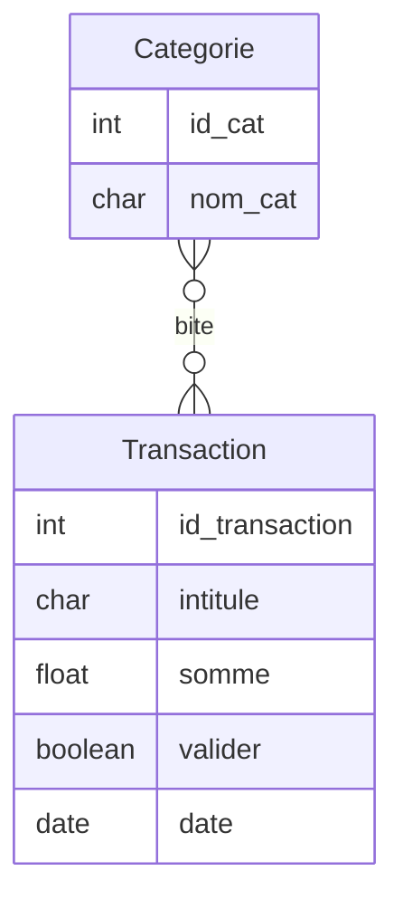

# BankProject

```mermaid

erDiagram 
    Transaction{
        int id_transaction 
        char intitule 
        float somme
        boolean valider
        date date
    }

    Categorie{
        int id_cat
        char nom_cat
    }

    Categorie }o--o{Transaction : bite
  


```
